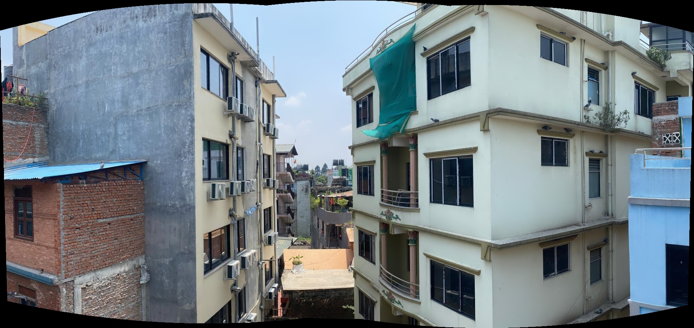

# Getting Started – OpenCV Projects Collection

This repository contains practical mini-projects using OpenCV to explore core computer vision techniques.

---

## ✅ Step 1: Panorama from 3 Images

- Loaded images: `1.jpeg`, `2.jpeg`, `3.jpeg`
- Created panorama using `cv2.Stitcher_create()`
- Output saved as `stitchedpanorama.jpeg`

### 🖼️ Output:

---

## 🛠️ Upcoming Steps
- HDR imaging
- Object tracking
- Keypoint visualization
- Perspective transforms

---
