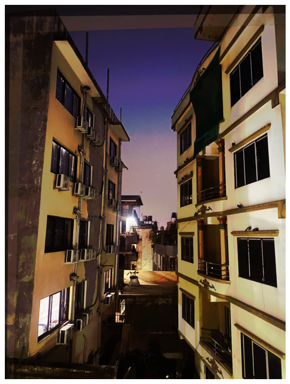
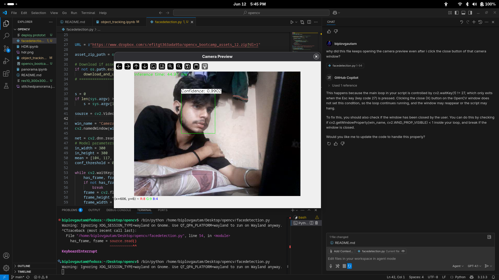
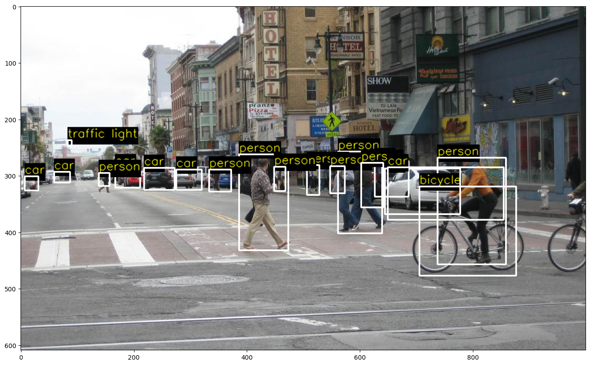
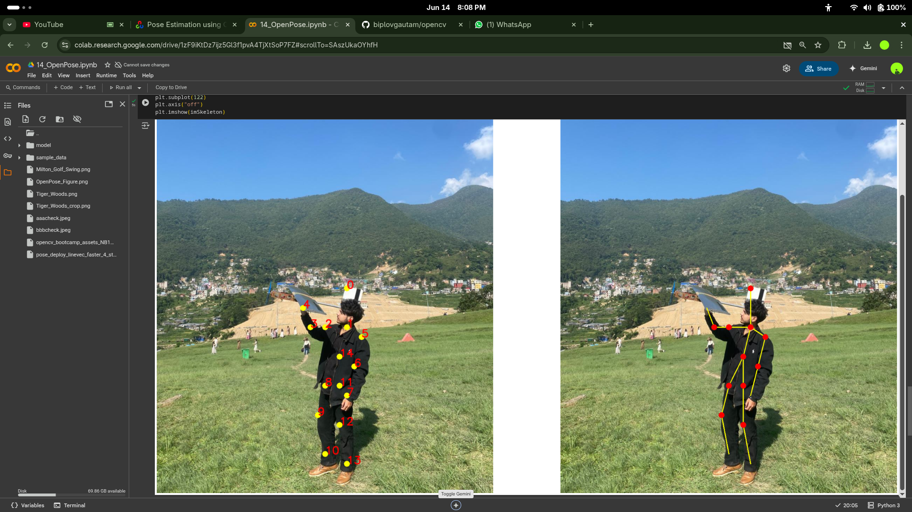

# Getting Started – OpenCV Projects Collection

This repository contains practical mini-projects using OpenCV to explore core computer vision techniques.

---

## ✅ Step 1: Panorama from 3 Images

- Loaded images: `1.jpeg`, `2.jpeg`, `3.jpeg`  
- Created panorama using `cv2.Stitcher_create()`  
- Output saved as `stitchedpanorama.jpeg`

### 🖼️ Output:  

---

## ✅ Step 2: HDR Imaging

- Loaded multiple exposure images  
- Created HDR image using OpenCV HDR algorithms  
- Output saved as `hdr.png`

### 🖼️ Output:  

---

## ✅ Step 3: Real-Time Face Detection

- Used pre-trained SSD ResNet-10 model for face detection  
- Captured video from webcam (`/dev/video2`)  
- Detected faces with bounding boxes and confidence scores  
- Displayed detection results live in window

### 🖼️ Output:  

---

## ✅ Step 4: Object Tracking

- Explored multiple OpenCV tracker algorithms (e.g., CSRT, KCF, MOSSE, etc.)  
- Initialized tracker with bounding box and tracked object across video frames  
- Visualized tracking results and saved output video

### 🖼️ Output:  

---

## ✅ Step 5: Deep Learning Object Detection

- Utilized TensorFlow-based SSD MobileNet v2 model  
- Detected multiple object classes (people, cars, bicycles, etc.)  
- Applied confidence threshold to filter detections  
- Visualized bounding boxes with class labels

### 🖼️ Output:  

---

## ✅ Step 6: Human Pose Estimation with OpenPose

- Implemented OpenPose deep learning model using OpenCV  
- Utilized pre-trained Caffe model for skeleton-based pose detection  
- Detected key body points with confidence scores  
- Connected points to visualize human pose skeleton

### 🖼️ Output:  

---

## 🛠️ Upcoming Steps

- Keypoint visualization  
- Perspective transforms

---
